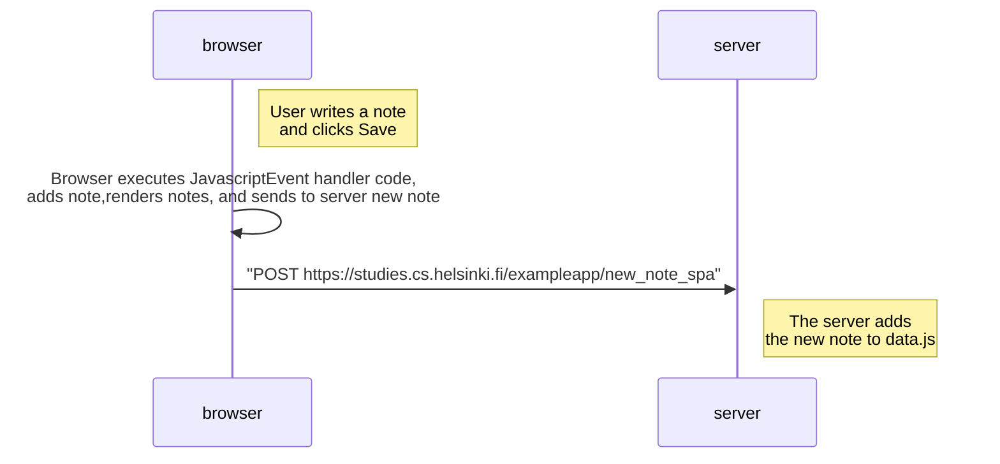

```mermaid
sequenceDiagram
    participant browser
    participant server

    Note right of browser: User writes a note <br/> and clicks Save
    browser->>browser: Browser executes JavascriptEvent handler code,<br/>adds note,renders notes, and sends to server new note
    browser->>server: "POST https://studies.cs.helsinki.fi/exampleapp/new_note_spa"
    Note right of server: The server adds<br/>the new note to data.js
    
```
